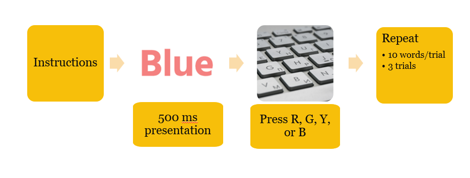

# Introduction
- Note from Christina: I'm gonna assume you'll explain Stroop Theory + general protocol of task so in methods I'll get straight into describing how *we* implemented our replication

# Methods
This study replicated the Stroop Effect by implementing the word-color visualizations on a computer screen. We wrote an experimental program in PsychoPy, an open-source software library written in Python, that delievered the experiment.

## Participants
Fifteen participants in the age range of 19-25 were recruited from an undergraduate upper-year psychology seminar course at the University of Waterloo. Each participant completed the Stroop Task on one of the researcher's computer.

## Experimental Task Design
Participants are introduced to the experiment with instructions describing the experiment protocol. After reading, participants are instructed to press the spacebar to proceed to the first trial of the experiment. There are a total of 3 trials, with 10 words being shown to participants in each trial. Each word is shown on the screen for 500 ms before disappearing, and participants are required to press a key to indicate the color of the word. The next word will not appear until participants give a response to the current word. @experiment_visual shows an illustration of the experiment protocol.
 

{#experiment_visual width="60%"}

The program randomly generates color words from the list: red, green, blue, yellow and the color of those words are also randomly selected among those colors. Thus, the chances of a word presentation being congruent or incongruent are random. The keys "r", "g","b","y" are assigned to the respective colors red, green, blue, yellow for participants to give their response when reporting the color of the word. Participants are able to exit the experiment at any time by pressing the "Esc" key.

## Data Processing and Analysis
During the experiment, the congruency of each word is recorded, and the participant's reaction time (the time in between stimulus presentation and keyboard response), and accuracy of response are recorded. These results are stored in a CSV file generated for each participant.

Two 2-way repeated measures ANOVA tests were performed examining the main effects of trial and congruency on reaction time and accuracy. Interactions effects between trial and congruency were considered on reaction time and accuracy as well.

# Results

# Discussion

# References {-}

::: {#refs}
:::