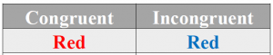
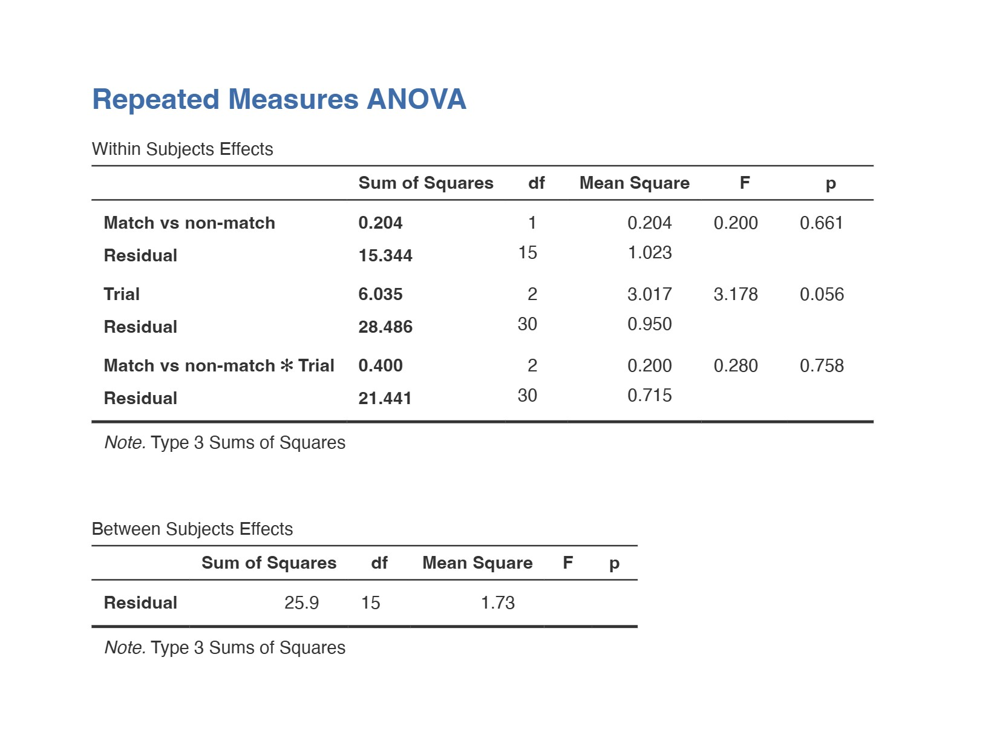
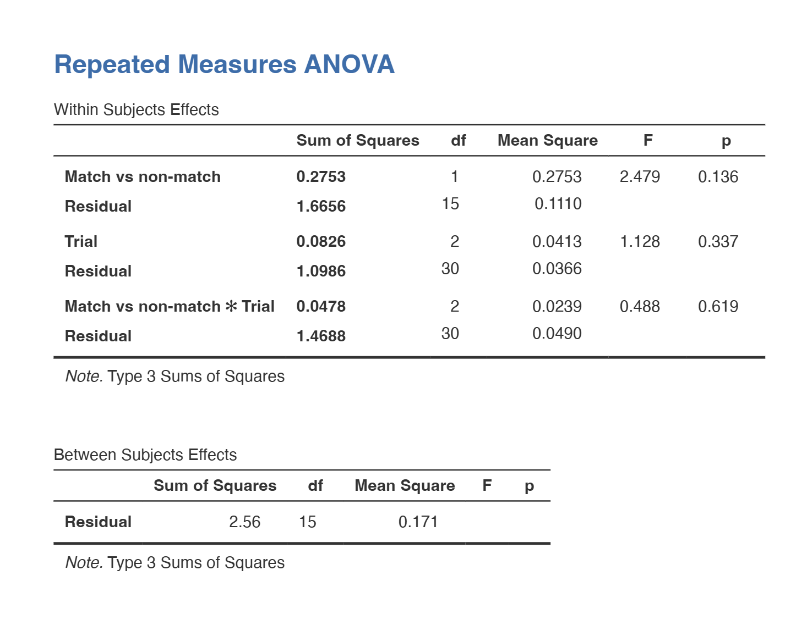

# Introduction {background-image="images/Screenshot 2026-03-30 231455.png"}

## Background(1): What is the Stroop Effect? {background-image="images/Screenshot 2026-03-30 231455.png"}
<br/>

::: {.incremental}
-  The Stroop effect refers to the cognitive interference that occurs when the brain processes two conflicting pieces of information at the same time
- First documented by J. R. Stroop (1935), it is one of the most studied phenomena in cognitive psychology 
:::

## Background(2): What is the Stroop Task?
- Color words are presented in different colors and participants are asked to name the color of the word, ignoring the word itself 
- Measures reaction time and accuracy as indicators of cognitive interference

{.absolute bottom="5" left="30" width="600" height='200'}

## Background(3): Key Findings {background-image="images/Screenshot 2026-03-30 231455.png"}
<br/>

@Stroop1935 found that participants were slower and less accurate when naming colors on incongruent trials compared to congruent ones 

<br/>

- This effect has been replicated across hundreds of studies, making it one of the most reliable findings in cognitive psychology

## Theoretical Explanations
:::: {.columns}

::: {.column width="40%"}
### Relative Speed of Processing
- Words are read faster than colors are named, so the word meaning always reaches the response stage first and interferes with color naming (@MacLeod1991)
:::
::: {.column width="10%"}
:::
::: {.column width="50%"}
### Automaticity{.center}
- Reading is so deeply practiced that it happens automatically. 
- Our brains process the word meaning even when we are trying to ignore it, which interferes with the slower, deliberate process of color naming
:::

::::

# Methods {background-image="images/Screenshot 2026-03-30 231455.png"}

## Our study aimed to replicate the Stroop effect

- We designed a computer task following the Stroop Task protocol introduced earlier, with each word being shown on the screen for 500 ms
 - Participants would not move on to the next word until they gave a response
 - 10 words/ trial -> 3 trials
- Hypothesis: Participants will show slower reaction times and lower accuracy on incongruent trials compared to congruent trials 

## Making the Task - An Important Feature {background-image="images/Screenshot 2026-03-30 231455.png"}
- Being able to store and save your data to a platform is important for organization, analysis, collaboration

::: {.small-box}
```python
import csv
import datetime

## MAKING THE CSV FILE
def init_csv():
    """Initialize CSV file with headers"""
    
    participant_id = input("Enter participant ID: ")
    
    timestamp = datetime.datetime.now().strftime("%Y%m%d_%H%M%S")
    
    filename = f"stroop_{participant_id}_{timestamp}.csv"
    
    with open(filename, 'w', newline='') as csvfile:
        fieldnames = ["trial", "word_number", "match", "reaction_time", "correct"]
        writer = csv.DictWriter(csvfile, fieldnames=fieldnames)
        writer.writeheader()
    
    return filename

## INPUTTING RESULTS TO CSV
def save_result_to_csv(trial_num, word_num, match_status, rt, correct_status):
    """Save one trial to CSV file"""
    
    with open(csv_filename, 'a', newline='') as csvfile:
        fieldnames = ["trial", "word_number", "match", "reaction_time", "correct"]
        writer = csv.DictWriter(csvfile, fieldnames=fieldnames)
        
        writer.writerow({
            "trial": trial_num,
            "word_number": word_num,
            "match": str(match_status),
            "reaction_time": rt,
            "correct": str(correct_status)
        })
```

:::

## Making The Task - Coding {background-image="images/Screenshot 2026-03-30 231455.png"}
<br/>
<br/>
We used pygame to code this task, so we had lots of help from LLMs and the [Pygame Documentation Webpage](https://www.pygame.org/docs/){preview-link="true"}

# Results {background-image="images/Screenshot 2026-03-30 231455.png"}

## Descriptives - Reaction Time & Accuracy {.small-text}
- Mean reaction time is 1.28 seconds.
- Mean accuracy rate is 86.4%.

::: panel-tabset
### RT
```{python}
import numpy as np
import matplotlib.pyplot as plt

trials = ["Trial 1", "Trial 2", "Trial 3"]
mean_RT = [1.63, 1.1, 1.1]

trials_number =np.arange(len(trials))
coefficients = np.polyfit(trials_number, mean_RT, 1)
p = np.poly1d(coefficients)
fig, ax = plt.subplots()
ax.scatter(trials, mean_RT)
ax.plot(trials_number, p(trials_number), "r--")
ax.set_xticks(trials_number, trials)
ax.set_xlabel("Trial")
ax.set_ylabel("Reaction Time (seconds)")
ax.legend()
ax.set_title("Figure 1: Changes in Mean Reaction Time Across Trials")
plt.show()
```

### Accuracy
```{python}
import numpy as np
import matplotlib.pyplot as plt

trials = ["Trial 1", "Trial 2", "Trial 3"]
mean_acc = [0.82, 0.87, 0.9]

trials_number =np.arange(len(trials))
coefficients = np.polyfit(trials_number, mean_acc, 1)
p = np.poly1d(coefficients)
fig, ax = plt.subplots()
ax.scatter(trials, mean_acc)
ax.plot(trials_number, p(trials_number), "r--")
ax.set_xticks(trials_number, trials)
ax.set_xlabel("Trial")
ax.set_ylabel("Mean Accuracy Rate")
ax.legend()
ax.set_title("Figure 2: Changes in Mean Accuracy Rates Across Trials")
plt.show()
```
:::

## Descriptives - Effects of Congruency on RT & Accuracy {.small-text}

::: {.small-text}
- Mean reaction time in incongruent trials is 1.28 seconds VS in congruent trials it's 1.19 seconds 
- Mean accuracy rate in incongruent trials is 81.3% VS in congruent trials it's 92.0%
:::

::: panel-tabset
### RT
```{python}
import numpy as np
import matplotlib.pyplot as plt

trials = ["Trial 1", "Trial 2", "Trial 3"]
congruent = [1.63,0.92,1.02]
incongruent = [1.55,1.16,1.14]

trials_number =np.arange(len(trials))
width = 0.35
plt.bar(trials_number-width/2, congruent, width, label="Congruent")
plt.bar(trials_number+width/2, incongruent, width, label="Incongruent")
plt.xlabel("Trials")
plt.ylabel("Reaction Time (seconds)")
plt.title("Figure 3: Effects of Congruency on RT")
plt.xticks(trials_number, trials)
plt.legend()
plt.tight_layout()
plt.show()
```

### Accuracy {.small-text}
```{python}
import numpy as np
import matplotlib.pyplot as plt

trials = ["Trial 1", "Trial 2", "Trial 3"]
cong = [0.92,0.87,0.97]
incong = [0.76,0.83,0.85]

trials_number =np.arange(len(trials))
width = 0.35
plt.bar(trials_number-width/2, cong, width, label="Congruent")
plt.bar(trials_number+width/2, incong, width, label="Incongruent")
plt.xlabel("Trials")
plt.ylabel("Accuracy Rate")
plt.title("Figure 4: Effects of Congruency on Accuracy")
plt.xticks(trials_number, trials)
plt.legend()
plt.tight_layout()
plt.show()
```
:::

## Analysis {background-image="images/Screenshot 2026-03-30 231455.png"}
:::{.small-text}
Two 2-Way Repeated Measures ANOVA tests were performed examining the main effects of trial and congruency on reaction time and accuracy, in addition to their interactions on both. 
:::

:::: {.columns}
::: {.column width="20%"}
- Table 1
:::

::: {.column width="37%"}
:::

::: {.columns width="20"}
- Table 2
:::
:::

{.absolute bottom="5" left="30" width="450" height='420'}
{.absolute bottom="20" right="80" width="400" height="400"}

## Discussion {background-image="images/Screenshot 2026-03-30 231455.png"}
- No significant Stroop effect (p = 0.661) or interaction (p = 0.758)
- While speeds improved across trials (p = 0.056), outliers of 13s and 19s inflated the Mean Square Residual (1.023), masking the actual effect
- High accuracy (90%) and keyboard latency further confounded results
- Due to these factors and a small sample (n = 16), we fail to reject the null hypothesis

# References {background-image="images/Screenshot 2026-03-30 231455.png"}

<br/>
<br/>

::: {#refs}
:::

# {background="#43464B" background-image="images/thankyou.jpeg"}
